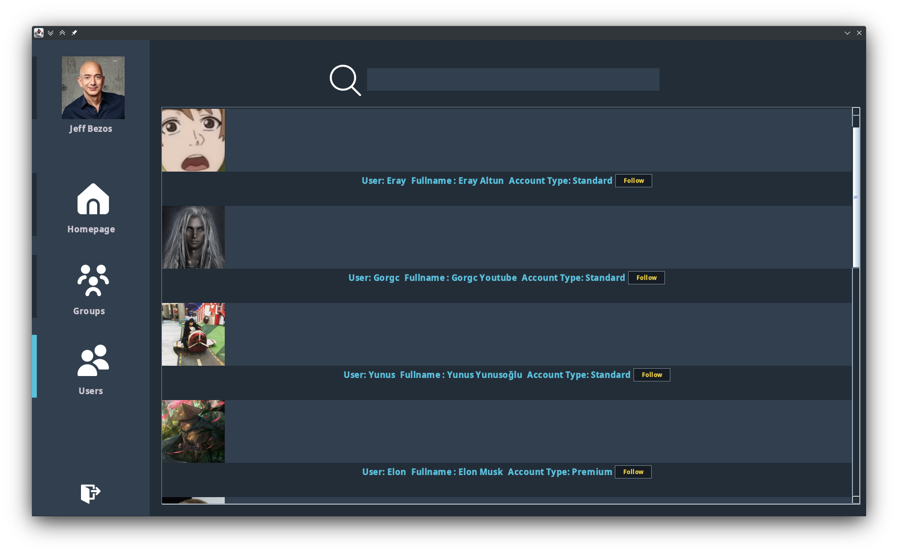

\maketitle
\tableofcontents
\newpage

# Guideline

## Execution Steps GUI

### Login/Register

When the application is launched you will be prompted to login.
<figure>{ width=200 margin=auto }</figure>

When register is clicked, a register JFrame will be shown.

{ width=210 }
{ width=210 }
\begin{figure}[!h]
\caption{Register Promt}
\end{figure}

\newpage

### Homepage

Once logged in, you will be greeted with the home page.
The homepage contains:

+ Search (title based, case sensitive)
+ Posts from users you follow.
+ Posts from groups you follow.

<figure>{ width=510 margin=auto }</figure>

\newpage
### Profile Page
You may go to the profile page to view your profile.
<figure>{ width=460 }</figure>
<figure>{ width=460 }</figure>

\newpage
You may create a group if you are a premium user.
<figure>{ width=210 margin=auto }</figure>

You may also edit your account.
<figure>{ width=120 margin=auto }</figure>

You can create your own personal contnet.
<figure>{ width=110 margin=auto }</figure>
\newpage

### Groups Page
+ You can join, leave groups. 
+ Edit your own content on the group page.

<figure>{ width=700 margin=auto }</figure>

\newpage
### Users Page

+ You can follow, and unfollow users in the users page. 
+ You can search for users.

<figure>{ width=700 margin=auto }</figure>

\newpage
# Project Design
## File Structure

<figure>{ width=300 margin=auto }</figure>

\newpage
## UI Builder

I used the UI builder in order to set the position of the panels, especially when using an absolute layout.
I benefit from the UI builder when trying to discern what methods are available for elements.
I have modified the auto-generated code to suit my needs, at times completely rewriting it.

After using an absolute layout for a considerable amount of time, I have learned the following:

### Absolute Layout

Pros:

+ Pixel-Perfect Alignment
+ Easy to design layout

Cons:

+ Not Resizeable
+ Breaks when OS uses any scaling

Overall thought:

+ Not recommended

\newpage
## Implemented types

The program is separated into two parts:
 
### frontend

+ Defines the GUI aspects of the program.

Is separated into two parts:

#### entry

+ Contains Login and Register JFrames.

#### postentry

+ Contains Creators: That instantiate objects of the backend
    + UserGroups
    + UserContent
    + GroupContent

+ Contains Editors: That modify the objects created by the creators
    + Account Editor
    + Content Editor
    + Group Editor

+ Contains Viewers: Are JPanels that define how the objects created by the creators should be displayed (similar to toString methods but for GUI)
    + Content Viewer
    + Group Viewers
    + User Viewer

+ Dashboard Panels: The panels that are held inside the dashboard
    + Groups
    + Profiles
    + Users

+ Colors: Simple Class that extends swings Color class in order to make a custom color palette.
+ Dashboard: A JFrame that holds login on switching between the dashboard panels.
+ Refreshable Interface: An interface that defines refresh.

### backend

+ Defines data classes that will be used by the frontend.
+ Defines logic on how the data should be manipulated.

#### Examples:

+ Content Class
+ User Class
+ UserGroup Class

\newpage

# Reference

+ https://docs.oracle.com/javase/7/docs/api/javax/swing/package-summary.html

+ https://thebadprogrammer.com/swing-uimanager-keys/

+ https://alvinalexander.com/java/java-uimanager-color-keys-list/

+ https://www.youtube.com/watch?v=1nEluKUOic8

+ https://www.geeksforgeeks.org/functional-programming-in-java-with-examples/

+ https://www.reddit.com/r/unixporn/

+ https://www.flaticon.com/

+ https://krita.org/en/

+ https://stackoverflow.com/questions/10850753/how-to-convert-a-liststring-into-a-comma-separated-string-without-iterating-li

+ https://stackoverflow.com/questions/29318404/how-to-set-javafx-password-field-echo-char

+ https://www.youtube.com/watch?v=dCIef0griJ0

+ https://www.youtube.com/watch?v=Kmgo00avvEw

+ https://docs.oracle.com/javase/8/docs/api/java/util/Collections.html

+ https://docs.oracle.com/javase/8/docs/api/java/lang/Comparable.html
     
+ https://docs.oracle.com/javase/8/docs/api/java/util/Iterator.html

+ https://docs.oracle.com/javase/8/docs/api/java/util/Comparator.html

+ https://docs.oracle.com/javase/8/docs/api/java/util/List.html

+ https://docs.oracle.com/javase/8/docs/api/java/util/Set.html

+ https://docs.oracle.com/javase/8/docs/api/java/util/Map.html

